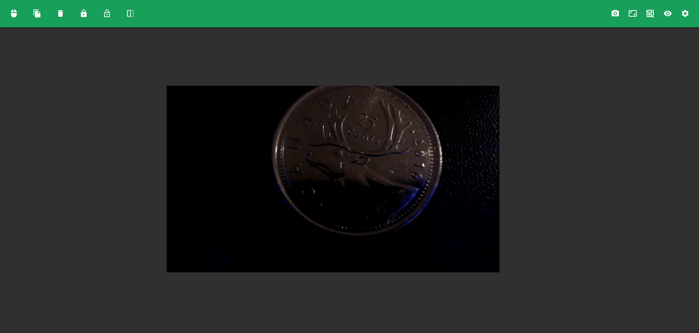

# mintview



## Overview

Mintview is an open-source coin examination/collection software. It was developed with the latest web technologies to give the best UI/UX.

## Installing

You can find the latest release of the software under the [mintview releases](https://github.com/alexandre-lavoie/mintview/releases).

## License

[MIT](./LICENSE)

## Contributing

Before contributing to this repository, please make sure to have a look at the [contribution guidelines](./CONTRIBUTING.md) and the [code of conduct](./CODE_OF_CONDUCT.md).

### Overview

The program is developed using [TypeScript](https://www.typescriptlang.org/) (which is a type extension of [JavaScript](https://developer.mozilla.org/en-US/docs/Web/JavaScript)). The frontend is developed using the [NextJS](https://nextjs.org/) framework (which is a Server-Side Rendering extension of [ReactJS](https://reactjs.org/)) with heavy use of the [Material-UI](https://material-ui.com/) and [Fabric.js](http://fabricjs.com/) packages. The backend will be developed using the [Express](https://expressjs.com/) framework and the [Apollo GraphQL](https://www.apollographql.com/) framework with the [TypeGraphQL](https://github.com/MichalLytek/type-graphql) package. The desktop application is packaged using [Nextron](https://github.com/saltyshiomix/nextron) (which is a NextJS implementation of [ElectronJS](https://www.electronjs.org/)).

### Getting Started

#### Prerequistes

- [NodeJS](https://nodejs.org)
- [npm](https://www.npmjs.com/get-npm)

#### Installing

With this software configured, you will want to clone this repository. Inside the repository file, you will want to run the following command:

```
npm install
```

Once complete, you should have all the dependencies required for this project.

### Running

#### Web Development Environment

You can start a web development environment using the following command:

```
npm start
```

A web development environment should run on http://localhost. This environment is configured with hot reloading and source codes. This allows for quicker production/debugging.

#### Desktop Development Environment

You can start a desktop development environment using the following command:

```
npm run start:electron
```

A development executable should appear on screen. This environment is configured with hot reloading, source codes, and automatic dev tools openning. This allows for quicker production/debugging.

### Building 

#### Web Environment (In Development)

You can build the web environment using the following command:

```
npm run build
```

This should create a distribution that can be run using a NodeJS server.

#### Desktop Environment

You can package the code for Windows, Linux, and Mac using the following command:

```
npm run build:electron
```

This will generate the packaged files in `./dist`. You can also target a specific operating system using any of the following commands:

```
npm run build:electron:win
npm run build:electron:mac
npm run build:electron:linux
```

If you have issues building because of `canvas.node`, run the following commands:

```
npm update
npm rebuild canvas --update-binary
```

## Documentation

You can find the documentation in the [documentation file](./DOCUMENTATION.md);